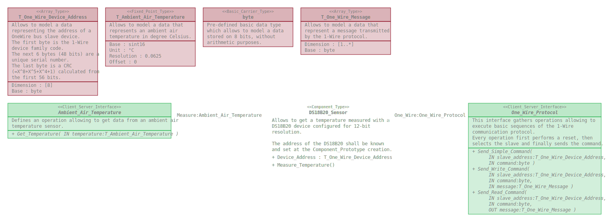

# DS18B20_Sensor

This repository defines a package gathering software elements allowing to
measure the air temperature using a DS18B20 device.

## Overview

## DS18B20_Sensor dynamic behavior

The operation _Measure_Temperature_ shall not be called at a period faster than
750ms (which is the temperature convertion time for a device configured for
12-bit resolution).

The execution time of the operation _Measure_Temperature_ depends on the
_One_Wire_Protocol_ interface implementation. Typical value should be below 7ms.

## Dependencies

* One_Wire_Interfaces : https://github.com/SanteyneEmbeddedSystems/One_Wire_Interfaces/releases/tag/v1.0.1
* Physical_Quantities_Interfaces : https://github.com/SanteyneEmbeddedSystems/Physical_Quantities_Interfaces/releases/tag/v1.0.0

## Use

### With the Arduino IDE

This repository shall be clone within the _libraries_ folder of the _Arduino
sketchbook folder_.
